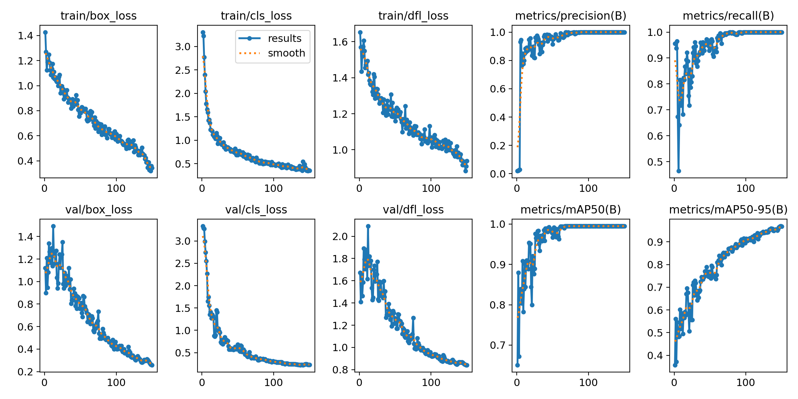
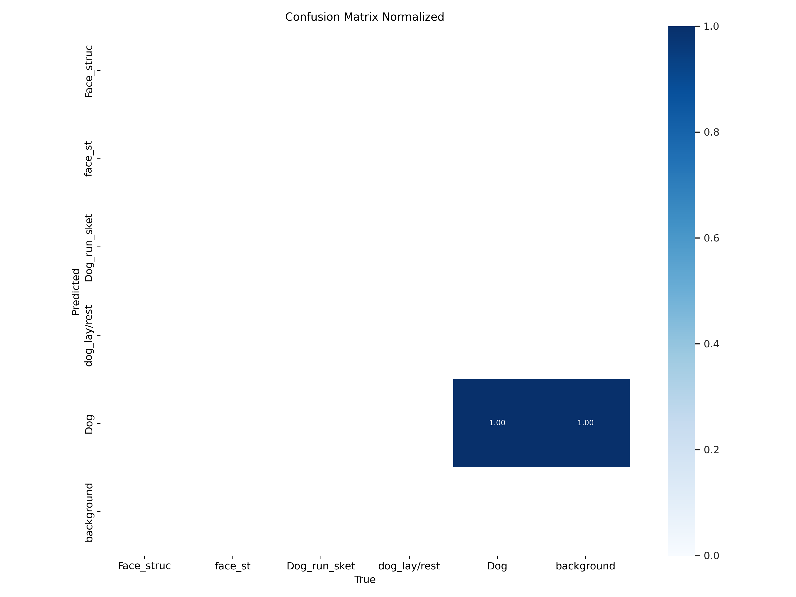
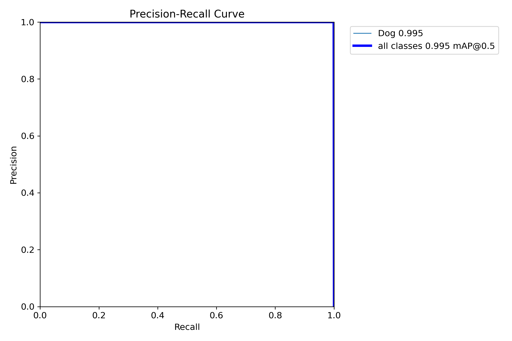
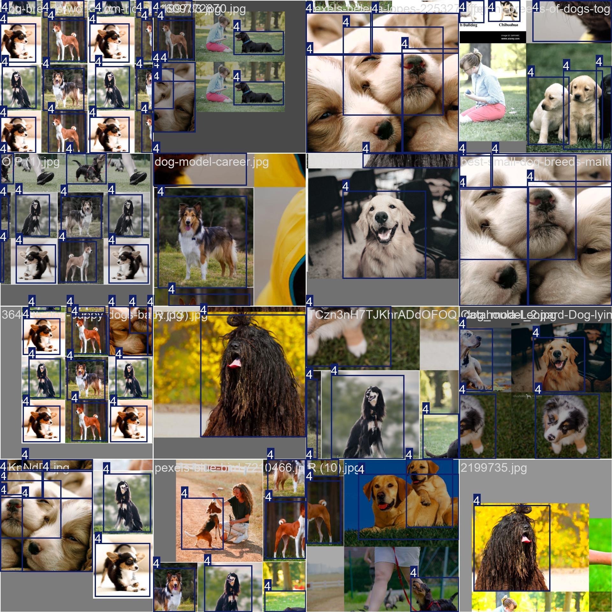
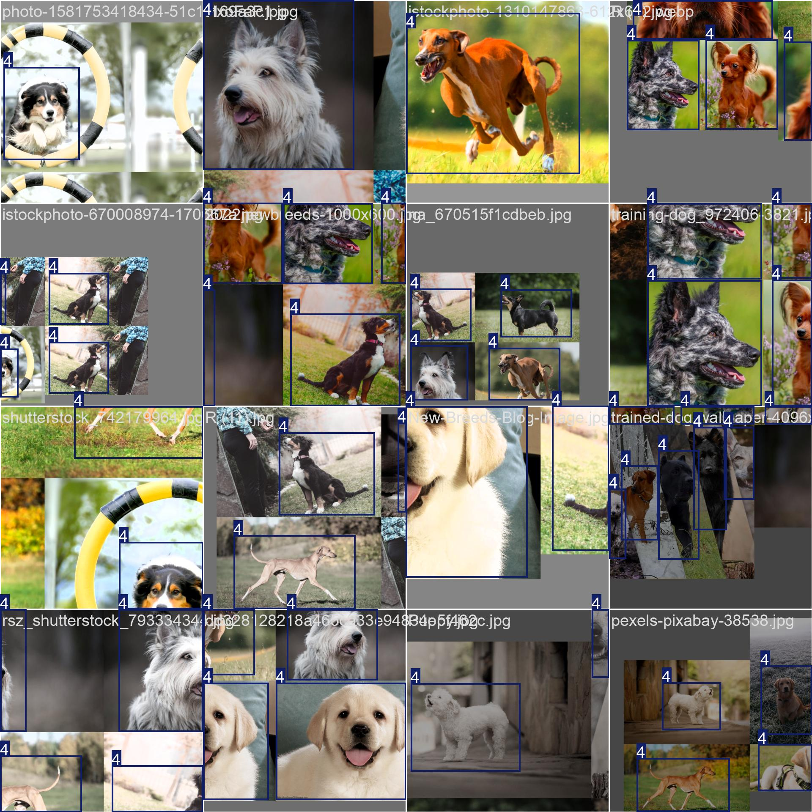
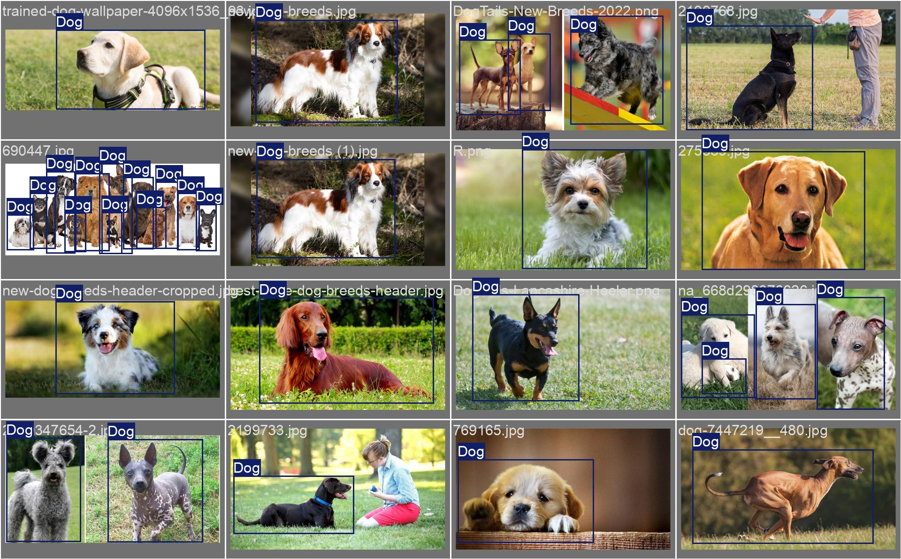
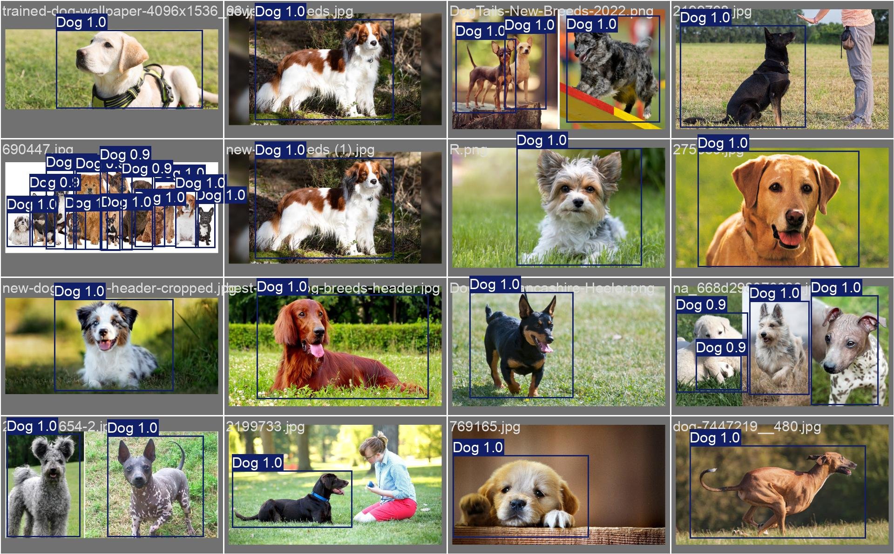
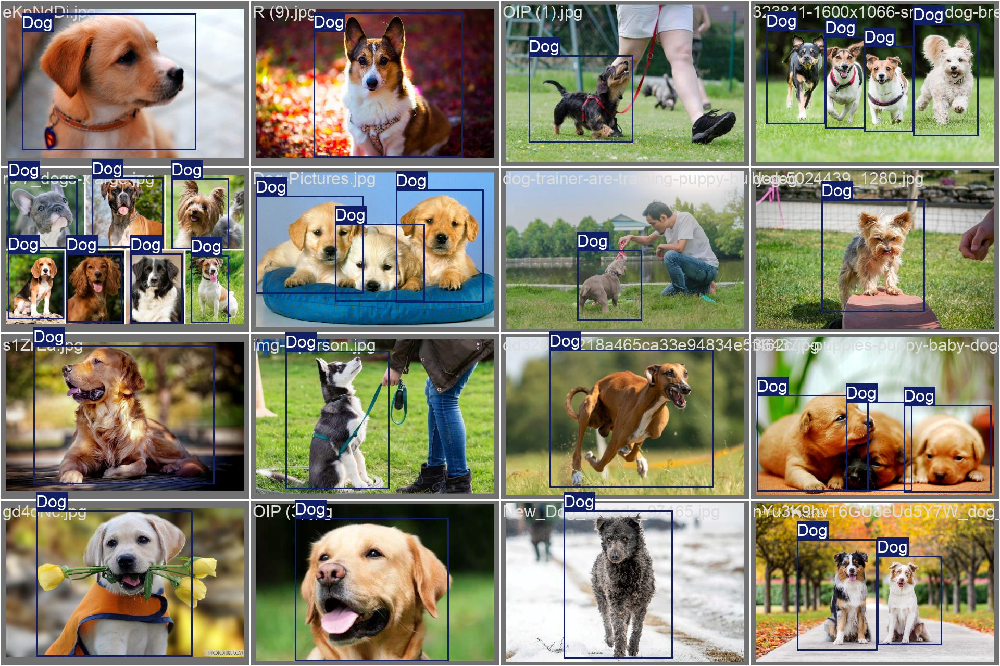

# Real-Time Animal Pose Estimation 🐾

A collaborative research project on real-time animal pose estimation using YOLO, published at IEEE in 2025.

📄 **Published Paper:** [IEEE Xplore](https://ieeexplore.ieee.org/document/11249593) &nbsp;|&nbsp; 📁 **Dataset:** [Google Drive](https://drive.google.com/drive/folders/1DkIQBkmlxgirXiz68SHCVaYJlQ6D62vG?usp=sharing)

---

## 👥 Authors

Md Roman Bhuiyan · Barbaros Yesilova · Anastasia Shadakh · **Shrish Arunesh** · Giulio Napolitano · Md Baharul Islam · Junaidi Abdullah

---

## 📌 Project Overview

The system detects body keypoints across four animal classes in real time using a fine-tuned YOLO model trained on a custom annotated dataset. Each team member was responsible for one animal class from data collection through to training and testing.

**Animal classes:** Chicken · Cow · Dog · Horse

---

## 🙋 My Contribution — Dog Class

| Step | What I did |
|------|-----------|
| Data Collection | Sourced dog images and videos from public domain sources |
| Annotation | Labelled keypoints in CVAT with a custom dog skeleton structure |
| Training | Fine-tuned YOLO on the annotated dataset using Google Colab (150 epochs) |
| Testing | Validated the model on both dog images and video footage |

---

## 📊 Results

| Metric | Score |
|--------|-------|
| PoseF1 | 57.8% |
| Precision | 63.2% |
| mAP@0.5 | 99.5% |
| Recall | 85.5% |

The dog class showed the most variation due to high intra-class variability dogs appear in more diverse poses, sizes, and fur patterns compared to other classes. Despite this, mAP@0.5 reached 99.5%.

### Training Curves


### Confusion Matrix (Normalized)


### Precision-Recall Curve


---

## 🖼️ Training Data

Sample images from the training batches — diverse dog breeds, poses, and environments:




---

## ✅ Validation — Labels vs Predictions

Ground truth labels (left) compared to model predictions (right):

**Batch 0**



**Batch 1**



---

## 🛠️ Stack

- **YOLO (Ultralytics)** - object detection and pose estimation
- **CVAT** - keypoint annotation with custom skeleton
- **Google Colab** - model training
- **Python** - data pipeline and inference

---

## 📁 Repo Structure

```
├── results/          # Training graphs, confusion matrix, PR curves, batch previews
├── training/         # Colab training script, args.yaml, data.yaml
├── weights/          # Trained model weights (.pt)
└── README.md
```

---

## 📄 Citation

```
Bhuiyan, M. R., Yesilova, B., Shadakh, A., Arunesh, S., Napolitano, G.,
Islam, M. B., & Abdullah, J. (2025). Real-Time Animal Pose Estimation
Using Computer Vision Techniques. IEEE.
https://ieeexplore.ieee.org/document/11249593
```